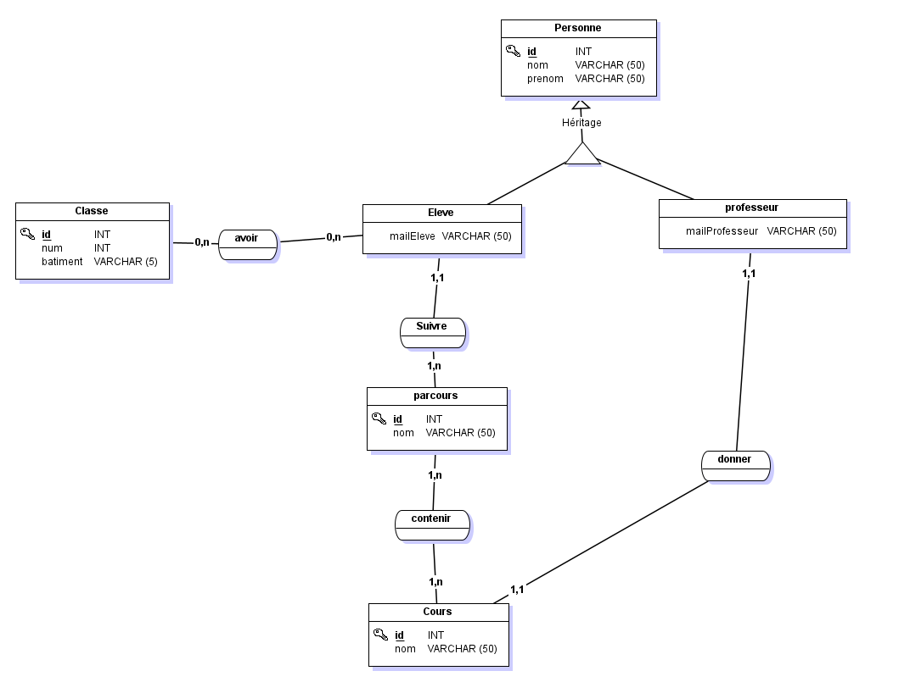

# Design Patterns - Java ☕

Réalisation d'un projet java utilisant les designs patterns : MyEfreiV2.

Date : 23 oct. 2023 - 24 oct. 2023

### Design patterns utilisés :

- [🔗](https://refactoring.guru/fr/design-patterns/prototype) Prototype
- [🔗](https://refactoring.guru/fr/design-patterns/factory-method) Factory
- [🔗](https://refactoring.guru/fr/design-patterns/observer) Observer

## Documentations 📄

- [Refactoring](https://refactoring.guru/fr)
- [Justifications du choix des patterns](Assets/JustificationsPatterns.docx)

## Author 👨‍💻

- [@armanceau2](https://www.github.com/armanceau2)🐵

- 

## Screenshot 📸

